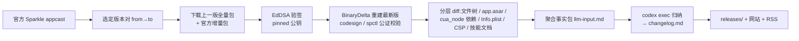

# Codex App Changelog

> 第三方、自动化的 **OpenAI Codex 桌面版逆向变更日志**。
> A third-party, automated reverse-engineered changelog for the OpenAI Codex desktop app.

官方对 Codex 桌面版的多数小版本并不发布 release notes,即便发布,粒度也远不到文件 / 依赖 / 权限这一层。本项目监控官方 Sparkle(macOS 应用更新框架)增量更新,**重建出每个新版的应用包**,对它和上一版做结构化差异,再用 LLM 把机器差异归纳成人类可读的变更说明——补上官方不写的那一层。

这是一份**差异审计 / 半自动 changelog**,不是官方变更日志的替代品。它只发布从官方签名分发产物 diff 出来的结论,不重分发任何官方二进制。

## 工作原理



信任根是第 4 步的 **EdDSA 验签**:证明拿到的是 OpenAI Sparkle 私钥签过的原始字节;第 5 步重建产物再过 `codesign --deep --strict` 与 `spctl`,确认我们 diff 的就是用户实际会装的那个包。公钥与 [codex-app-manager](https://github.com/Wangnov/codex-app-manager) 的 `verify.rs` 一致。

## 快速开始(本地)

**依赖**(仅 macOS,因为重建依赖 `ditto` / `codesign` / `spctl` / Sparkle BinaryDelta):

- Python 3 + `cryptography`(`pip install cryptography`)
- Node.js(用 `npx @electron/asar` 解包 app.asar)
- [Codex CLI](https://github.com/openai/codex)(`codex exec` 做 LLM 归纳,需已登录)
- `curl`

**跑一次完整流水线**(默认比较 appcast 里最新两版):

```bash
scripts/run.sh                              # 最新两版
scripts/run.sh --to-build 3808 --from-build 3722   # 指定版本对
scripts/run.sh --skip-llm                   # 只产出事实包,不调 LLM
```

产物落在 `work/<from>-<to>/`,最终的 `changelog.md` 即第三方变更日志。

**只重跑 LLM 这一步**(调提示词时很有用,秒级迭代):

```bash
python3 scripts/build_llm_input.py --work work/3722-3808   # 重建事实包
scripts/analyze.sh work/3722-3808                          # 重新归纳
```

## 目录结构

```
releases/            已发布的 changelog(每版一篇,如 v26.609.30741.md)
prompts/changelog.md codex exec 的提示词(决定输出风格与结构)
scripts/
  fetch_appcast.py     拉 appcast,选版本对 → metadata
  vendor_binary_delta.sh  取 Sparkle BinaryDelta(pinned sha256)
  download_verify.py   下载 + EdDSA 验签
  reconstruct.sh       ditto 解包 + BinaryDelta 重建 + 公证校验 + 解 asar
  diff_bundle.py       bundle 文件树差异
  diff_asar.mjs        app.asar 内容差异
  diff_packages.mjs    cua_node 依赖差异
  diff_targeted.py     定向文本差异(plist / CSP / 技能文档 / 类型声明)
  build_llm_input.py   聚合事实包 llm-input.md
  analyze.sh           codex exec 归纳 → changelog.md
  run.sh               端到端编排
work/                运行时产物(git-ignored,含大文件)
```

## 自动化(GitHub Actions)

**关键约束:重建必须在 macOS runner 上跑**(`ditto` / `codesign` / `spctl` / BinaryDelta 都是 macOS 工具)。轮询检测可以很轻量,但重建+diff这一段绕不开 macOS。

`​.github/workflows/watch-and-build.yml`(草稿)按 cron 定时:拉 appcast → 若出现 `releases/` 里还没有的新 build → 在 macOS runner 上跑 `run.sh` → 把 `changelog.md` 落为 `releases/v<short>.md` → 提交 / 开 PR → 触发网站 + RSS。

需要配置的 secret:

- `CODEX_AUTH` —— `codex exec` 在 CI 里的认证(形式取决于你的 Codex 登录方式;本地是 `~/.codex/auth.json`)。
- 其余用自带 `GITHUB_TOKEN`。

**省 runner 分钟数的可选架构**(效仿 [codex-app-mirror](https://github.com/Wangnov/codex-app-mirror) 的 CF Workers 轮询):用一个 Cloudflare Worker 高频轮询官方 appcast,只在发现新 build 时通过 `repository_dispatch` 触发 GitHub Action,避免 macOS runner 空跑。

## 证据分级与边界

每条变化标注证据等级:**【实证】**(有 plist 键值 / CSP 文本 / 技能文档 / 类型声明 / 依赖清单 / 签名等直接证据)或 **【信号】**(只有前端模块名或体积变化,指向某方向但无法还原源码意图)。

本项目与 OpenAI 无关,不代表官方立场。混淆 / 压缩代码在缺少 source map 时无法保证还原意图;欢迎基于同样的证据标准指正。

## 关联项目

- [codex-app-manager](https://github.com/Wangnov/codex-app-manager) —— 官方 Codex 桌面版的安装 / 更新 / 卸载管理器,本项目复用了它验证过的 Sparkle 公钥与 BinaryDelta 获取方式。
- [codex-app-mirror](https://github.com/Wangnov/codex-app-mirror) —— Codex 安装包的国内可达镜像与 Sparkle 更新源。
